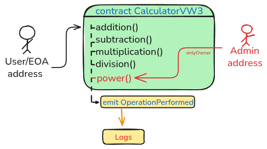

# 🧮 CalculatorVW3

**CalculatorVW3** is a smart contract written in Solidity that performs main arithmetic operations while showcasing fundamental smart contract development concepts.

The contract keeps track of the most recent calculation result and emits an event for every operation executed. This enables off-chain applications and users to easily monitor contract activity.

This project was built using the **Foundry** smart contract development framework using core Solidity concept and best practices including: *Smart contract structure, Events, Enums, Modifiers, State variables, NatSpec documentation, Foundry project organization, Unit testing*

## ⚙️ Contract Features



The contract supports the following arithmetic operations:


| Operation      | Function Name      |
| ---------------- | -------------------- |
| Addition       | `addition()`       |
| Subtraction    | `subtraction()`    |
| Multiplication | `multiplication()` |
| Division       | `division()`       |
| Power          | `power()`          |

**Power function uses a basic access control system, *owner address is required*.**

Each function follows the same workflow:

1. Performs the arithmetic operation
2. Stores the result in the `lastResult` state variable
3. Emits the `OperationPerformed` event

## 🧪 Testing

All unit tests are located in the `/unit` directory and cover every operation implemented in the contract while fuzzing test is included in the `/fuzz` directory.

### 📊 Coverage Report

```
╭-----------------------+-----------------+-----------------+---------------+-----------------╮
| File                  | % Lines         | % Statements    | % Branches    | % Funcs         |
+=============================================================================================+
| src/CalculatorVW3.sol | 100.00% (30/30) | 100.00% (21/21) | 100.00% (3/3) | 100.00% (10/10) |
|-----------------------+-----------------+-----------------+---------------+-----------------|
| Total                 | 100.00%         | 100.00%         | 100.00%       | 100.00%         |
╰-----------------------+-----------------+-----------------+---------------+-----------------╯
```

## 🚀 Getting Started

Build

```bash
forge build
```

Test

```bash
forge test

```

This project is licensed under the MIT License.
